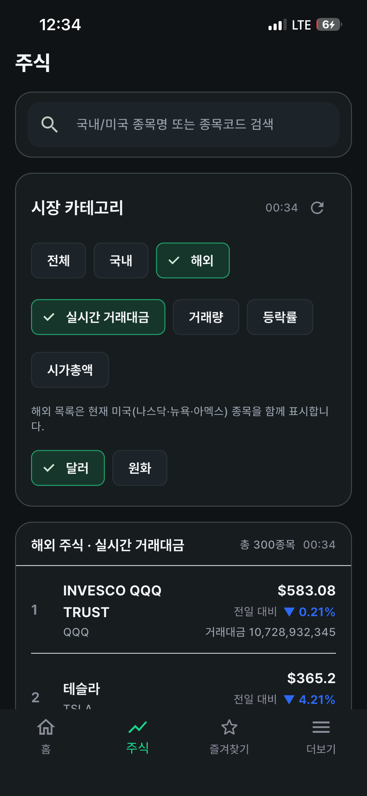
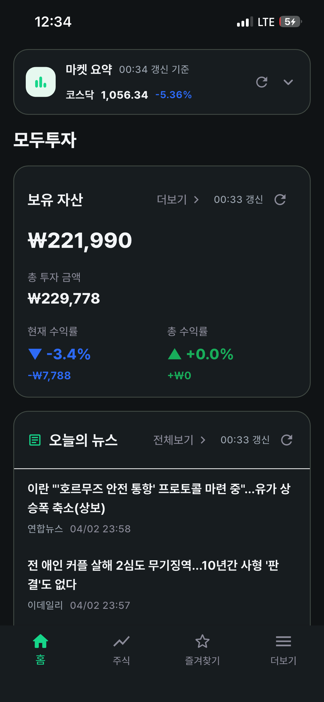
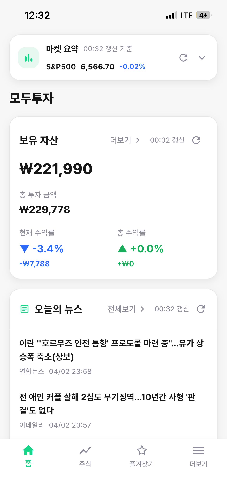
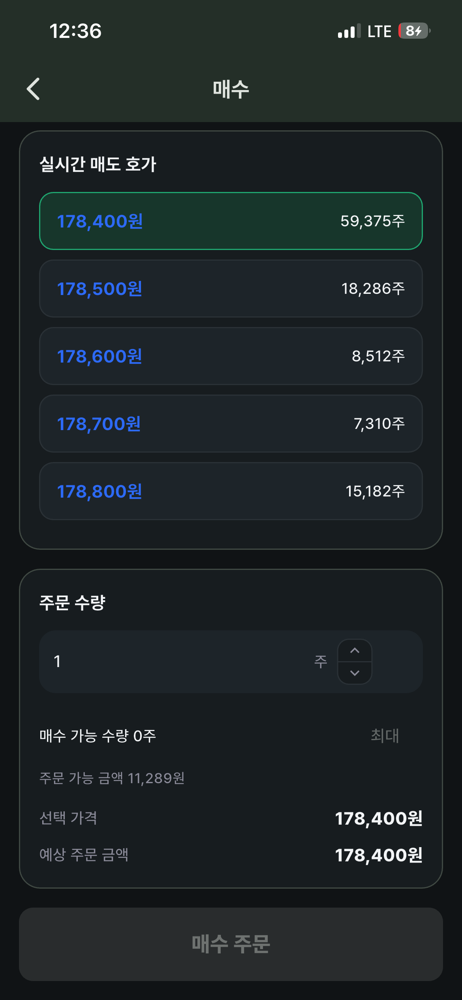

# Motu

Motu는 국내/해외 주식 시세 조회, 보유 자산 확인, 관심 종목 관리, 상세 차트 확인, 주문 화면까지 포함한 Flutter 기반 주식 앱입니다.  
KIS OpenAPI를 기반으로 계좌/시세 데이터를 불러오며, 실시간 가격이 필요한 화면은 소켓 기반으로 반영하도록 구성되어 있습니다.

## 주요 기능

- 국내/해외 주식 검색
- 홈 탭 자산 요약, 마켓 요약, 뉴스, 투자자 수급, 급등/거래량 정보
- 주식 탭 카테고리별 랭킹 조회
- 즐겨찾기 탭 관리
- 종목 상세 화면
- 실시간 가격/체결량 반영
- 국내 주문 화면
- 물타기 계산기
- 다크 모드 지원

## 샘플 화면

| 홈 | 주식 |
| --- | --- |
|  |  |

| 상세 | 더보기 |
| --- | --- |
|  |  |

## 기술 스택

- Flutter
- Dart
- Riverpod
- Flutter Secure Storage
- KIS OpenAPI

## 프로젝트 구조

프로젝트는 MVVM 구조를 기본으로 사용합니다.

- `lib/models`
  데이터 모델
- `lib/repositories`
  API 호출, 응답 파싱, 외부 데이터 접근
- `lib/viewmodels`
  화면 상태와 비즈니스 로직
- `lib/views`
  화면 렌더링과 라우팅
- `lib/core`
  네트워크, 테마, 공통 인프라
- `server`
  KIS API 정의서 및 참고 문서
- `design`
  화면 디자인 참고 자료

세부 구조 원칙은 [`structure.md`](structure.md)를 참고하세요.

## 실행 전 준비

실계좌 정보와 앱 키는 저장소에 넣지 않고 `--dart-define` 또는 로컬 JSON 파일로 주입해야 합니다.

필수 값:

- `KIS_APP_KEY`
- `KIS_APP_SECRET`
- `KIS_ACCOUNT_NO`
- `KIS_ACCOUNT_PRDT_CD`
- `KIS_USE_MOCK`

예시:

```bash
flutter pub get
flutter run --dart-define-from-file=env/kis.local.json
```

또는

```bash
flutter run \
  --dart-define=KIS_APP_KEY=your_app_key \
  --dart-define=KIS_APP_SECRET=your_app_secret \
  --dart-define=KIS_ACCOUNT_NO=12345678 \
  --dart-define=KIS_ACCOUNT_PRDT_CD=01 \
  --dart-define=KIS_USE_MOCK=false
```

## iOS 실행

```bash
flutter pub get
cd ios
pod install
cd ..
flutter run
```

Xcode에서는 반드시 `ios/Runner.xcworkspace`를 열어 실행하는 것을 권장합니다.

## Android 실행

```bash
flutter pub get
flutter run
```

## 분석 및 테스트

```bash
flutter analyze
flutter test
```

## 참고 문서

- KIS 접근 토큰 관련 문서: `server/getAccessTokens.xlsx`
- 전체 API 정의서: `server/openAPI.xlsx`
- 미구현 API 정리: `docs/api_gap.md`
- 구조 문서: `structure.md`
- 에이전트 작업 규칙: `AGENTS.md`

## 주의 사항

- 계좌 정보, 앱 키, 시크릿 키는 Git에 커밋하지 않습니다.
- 가격이 표시되는 화면은 실시간 소켓 연결을 전제로 설계되어 있습니다.
- 주문 기능은 계좌/장 상태/호가 상태에 영향을 받습니다.

## 라이선스

사내 또는 개인 프로젝트 용도로 관리 중인 저장소입니다. 별도 라이선스 정책이 없다면 외부 배포 전 확인이 필요합니다.
